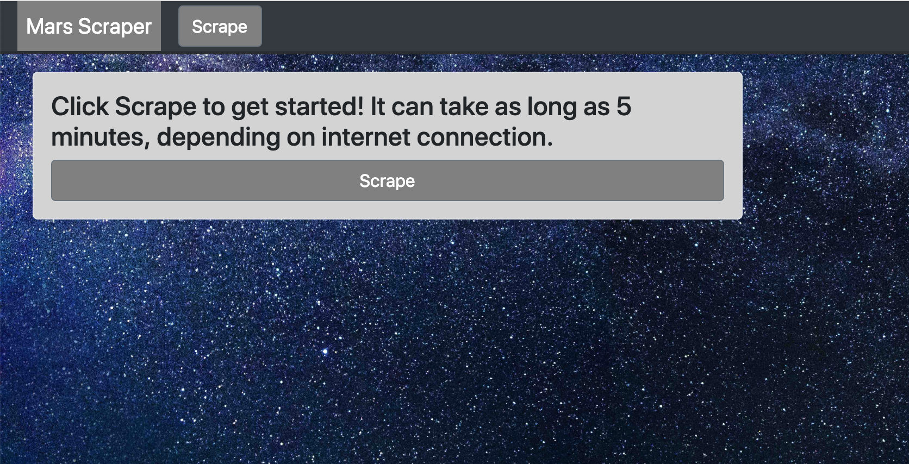
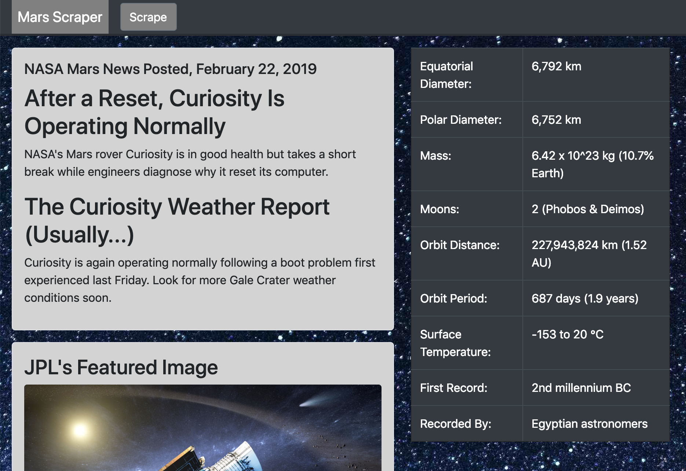
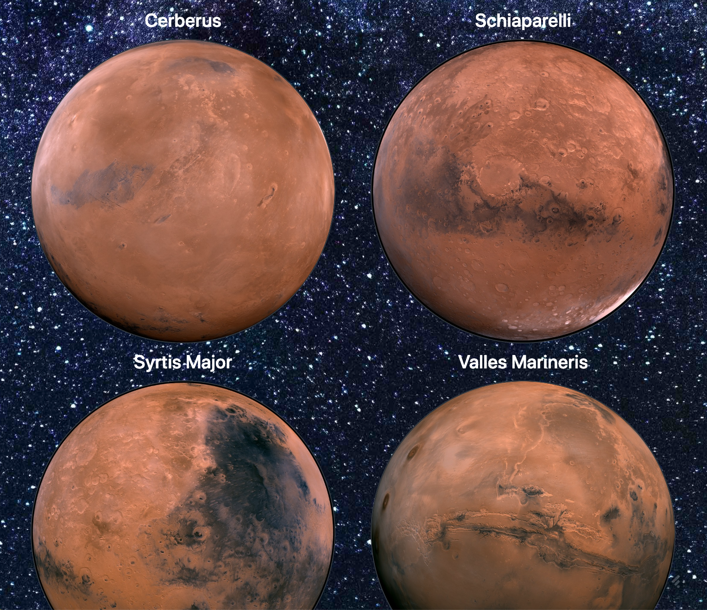

# Web Scraping and NoSQL DBs in Flask App

Scraped images and article headlines from the following websites using the Splinter library for python, parsed with BeautifulSoup4:

* https://mars.nasa.gov/news/
* https://www.jpl.nasa.gov/spaceimages/?search=&category=Mars
* https://twitter.com/marswxreport?lang=en
* https://space-facts.com/mars/
* https://astrogeology.usgs.gov/search/results?q=hemisphere+enhanced&k1=target&v1=Mars

Which were then rehosted using the flask library on the localhost.

NOTE: in order to run the app, must host a MongoDB server on port 27017.

Examples screenshots of the webpage:

